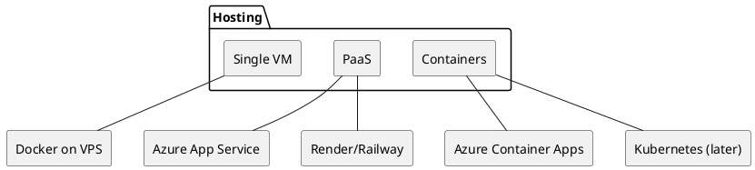

# Luxury Car Rental – Decision Matrix & Options

This document captures the key **non-stack** decisions for the luxury car rental project, with option lists you can later mark as chosen for v1.

---

## 1. Hosting & Infrastructure

**Decision table:**

| Topic            | Options                                                              | Notes / Trade-offs                         | Chosen for v1 |
| ---------------- | -------------------------------------------------------------------- | ------------------------------------------ | ------------- |
| Deployment style | Single VPS, PaaS (Azure App Service, Render/Railway), Containers/K8s | PaaS is easiest to start                   |               |
| Edge / CDN       | Cloudflare, Azure CDN, none                                          | Likely Cloudflare for static + API routing |               |
| SSL termination  | Let’s Encrypt via proxy, managed cert via PaaS                       |                                            |               |

---

## 2. Auth, Identity & Roles

**Identity provider options:**

* Custom ASP.NET Identity (JWT)
* External IdP (Auth0, Azure AD B2C, Keycloak)

**Login methods:**

* Email + password only
* Email + social (Google, Apple)

**Roles:**

* `customer`
* `admin`
* `fleet_manager`
* `support`

**Decision table:**

| Topic         | Options                                         | Notes / Trade-offs                   | Chosen for v1 |
| ------------- | ----------------------------------------------- | ------------------------------------ | ------------- |
| IdP           | ASP.NET Identity, Auth0, Azure AD B2C, Keycloak | In-house vs external complexity/cost |               |
| Login methods | Email+password, +Google, +Apple                 | UX vs implementation effort          |               |
| Roles model   | Simple RBAC, fine-grained permissions later     | Start simple RBAC, extend if needed  |               |

---

## 3. Content & CMS Strategy

**Where does content live?**

* In code (markdown/JSON in repo) for demo
* Headless CMS (Sanity, Strapi, Payload, Contentful)
* WordPress (headless or traditional) for marketing

**Who edits what?**

* Client/marketing team: landing text, fleet descriptions, testimonials
* Devs: system messages, UX copy for flows and errors

**Decision table:**

| Topic            | Options                                   | Notes                          | Chosen for v1 |
| ---------------- | ----------------------------------------- | ------------------------------ | ------------- |
| Content storage  | In-repo markdown, Headless CMS, WordPress | Headless CMS for flexibility   |               |
| Editor ownership | Client vs dev for each content type       | Clarify responsibilities early |               |

---

## 4. Design System & UX

**Design language options:**

* Ultra minimal (black/white/gold)
* More visual (large imagery, heavy motion)

**Component system:**

* Custom Tailwind design system
* Tailwind + shadcn/ui / Radix primitives

**Accessibility target:**

* WCAG AA
* WCAG AAA (if feasible)

**Decision table:**

| Topic            | Options                               | Notes                     | Chosen for v1 |
| ---------------- | ------------------------------------- | ------------------------- | ------------- |
| Visual style     | Minimal, Visual-heavy, Hybrid         | Luxury brand alignment    |               |
| Component system | Custom Tailwind, Tailwind + shadcn/ui | Speed vs control          |               |
| Accessibility    | AA, AAA                               | AA minimum for production |               |

---

## 5. Performance, Caching & Scaling

**Caching layers:**

* CDN for static assets
* Application cache (Redis) for hot reads
* DB-level indexing

**Scaling strategy:**

* Vertical scale first (bigger instances)
* Horizontal scale (multiple instances + load balancer) later

**Decision table:**

| Topic          | Options                          | Notes                               | Chosen for v1 |
| -------------- | -------------------------------- | ----------------------------------- | ------------- |
| Cache strategy | CDN only, CDN + Redis, DB only   | Start with CDN, add Redis if needed |               |
| Scaling plan   | Vertical first, Horizontal later |                                     |               |

---

## 6. Pricing, Availability & Business Rules

**Pricing models:**

* Flat daily rate
* Weekend/seasonal multipliers
* Event/holiday overrides
* Member tiers (loyalty discounts)

**Availability rules:**

* One booking per car per time range
* Buffer blocks before/after for cleaning

**Configuration source:**

* Config in code (early demo)
* Config tables + admin UI

**Decision table:**

| Topic              | Options                                        | Notes                       | Chosen for v1 |
| ------------------ | ---------------------------------------------- | --------------------------- | ------------- |
| Base pricing model | Flat, weekend uplift, seasonal, loyalty tiers  | Start flat + weekend uplift |               |
| Availability rules | Strict blocking, buffers, overbooking allowed? | Likely strict, with buffers |               |
| Config storage     | In code, in DB, feature-flag system            | Demo: code → v1: DB         |               |

---

## 7. Analytics, Tracking & Experimentation

**What to track:**

* Funnels (landing → fleet → booking → payment → success)
* Events: booking started, quote viewed, booking abandoned

**Tools:**

* GA4
* Plausible / Matomo
* Session replay (Hotjar / FullStory) for UX debugging

**Decision table:**

| Topic          | Options                 | Notes                        | Chosen for v1 |
| -------------- | ----------------------- | ---------------------------- | ------------- |
| Analytics tool | GA4, Plausible, Matomo  | Plausible for simple privacy |               |
| Replay tool    | None, Hotjar, FullStory | Optional for UX debugging    |               |

---

## 8. Support, Communication & Notifications

**Channels:**

* Email only
* Email + WhatsApp
* Email + SMS + WhatsApp

**Notification triggers:**

* Booking request created
* Booking approved/declined
* Payment received/refunded
* Reminder before pickup

**Providers:**

* Email: Postmark, SendGrid, Mailgun
* WhatsApp/SMS: Twilio or local provider

**Decision table:**

| Topic          | Options                                   | Notes                 | Chosen for v1 |
| -------------- | ----------------------------------------- | --------------------- | ------------- |
| Channels       | Email, Email+WhatsApp, Email+SMS+WhatsApp | Start with email only |               |
| Email provider | Postmark, SendGrid, Mailgun               |                       |               |
| SMS/WhatsApp   | None, Twilio, local provider              |                       |               |

---

## 9. Legal, Compliance & Risk

**Docs needed:**

* Terms of Service
* Privacy Policy
* Rental Agreement template
* Insurance terms / disclaimers

**Compliance:**

* POPIA (South Africa)
* GDPR (if EU residents)

**Decision table:**

| Topic            | Options                                   | Notes                           | Chosen for v1 |
| ---------------- | ----------------------------------------- | ------------------------------- | ------------- |
| Legal base docs  | ToS, Privacy, Rental Agreement, Insurance | Draft templates vs lawyer-proof |               |
| Compliance focus | POPIA-only, POPIA+GDPR                    | Depends on target markets       |               |

---

## 10. Project Management & Delivery

**Planning style:**

* Scrum-ish sprints (2 weeks)
* Kanban
* Milestone-based (MVP → Beta → V1)

**Tools:**

* GitHub Issues/Projects
* Notion / Linear / Jira
* Figma for design

**Decision table:**

| Topic          | Options                      | Notes                            | Chosen for v1 |
| -------------- | ---------------------------- | -------------------------------- | ------------- |
| Planning style | Sprints, Kanban, Milestones  |                                  |               |
| PM tools       | GitHub, Notion, Linear, Jira | Start with GitHub + simple board |               |

---

## 11. Feature Flags & Configuration

**Flags to consider:**

* Loyalty program
* Dynamic pricing
* Experimental UI features

**Implementation:**

* Simple DB table (`FeatureFlags`)
* External service (LaunchDarkly, ConfigCat)

**Decision table:**

| Topic         | Options                                   | Notes                  | Chosen for v1 |
| ------------- | ----------------------------------------- | ---------------------- | ------------- |
| Flag storage  | DB table, external service, in-code flags | DB table is simplest   |               |
| Initial flags | Loyalty, dynamic pricing, experimental UI | Off by default in demo |               |

---

You can now mark decisions per row for MVP vs later phases, and expand any section into its own detailed spec if required.
