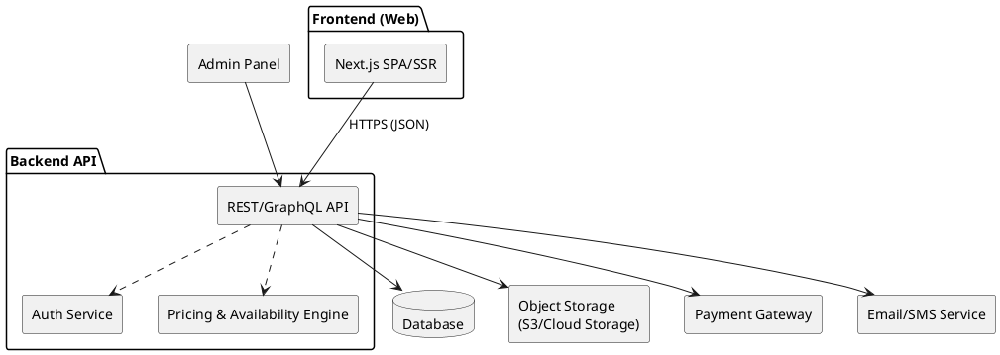

# Luxury Car Rental Website – Tech Stack & Planning

## 1. Core Feature Areas

### 1.1 Public Marketing Site

* Hero section with cinematic imagery / video
* Curated fleet gallery with filters (brand, type, price, location)
* "How it works" overview
* Pricing & deposit summary (insurance, mileage, extras)
* Testimonials and client logos
* Content pages: About, Contact, FAQ, T&Cs, Privacy, Cookies

### 1.2 Booking Journey

* Date & time picker (start / end)
* Pickup and dropoff locations
* Car selection filtered by chosen dates
* Upsells: chauffeur, delivery, extra insurance, add-ons
* Price breakdown: base rate, extras, deposit, taxes
* Guest checkout and/or account-based checkout

### 1.3 Customer Account

* View upcoming bookings and history
* Download invoices / confirmations
* Upload documents (license, ID/passport)
* Manage payment methods
* Update profile details

### 1.4 Admin / Operations

* Fleet management (cars, photos, specs, rate plans)
* Booking management (approve / modify / cancel / refund)
* Maintenance & availability holds
* Discount codes / promos
* Basic reporting (revenue, utilization, popular cars)

### 1.5 Integrations

* Payments (Stripe / Paystack / Yoco / PayFast)
* Email + SMS / WhatsApp notifications
* Maps (Google Maps / Mapbox)
* Optional CRM (e.g. HubSpot) later

---

## 2. Architecture Options

### 2.1 Option A – Static / Jamstack (Marketing-Only MVP)

**Use when:**

* Primary need is a high-end marketing site.
* Bookings can be handled manually (forms, WhatsApp, email).

**Characteristics:**

* Static site, generated at build time.
* Content (fleet, pages) managed via headless CMS.
* Booking form sends leads (email/CRM) instead of live availability.

**Typical stack:**

* Frontend: Next.js / Astro / Nuxt
* CMS: Sanity / Contentful / Strapi / headless WordPress
* Hosting: Vercel / Netlify / Cloudflare Pages

**Pros:**

* High performance and SEO
* Very low backend complexity
* Easy to iterate on visuals

**Cons:**

* No real-time availability or pricing logic
* No proper customer accounts or admin panel

---

### 2.2 Option B – API + Decoupled Frontend (Full Booking System)

**Use when:**

* You need proper booking, pricing, document uploads.
* You want future Android/iOS apps to reuse the same backend.

**High-level structure (PlantUML):**

**Pros:**

* Clean separation (web + mobile can share the API)
* Scales with more features (dynamic pricing, loyalty, etc.)

**Cons:**

* More moving parts (infra, monitoring, auth, CI/CD)

---

### 2.3 Option C – Full-Stack Monolith (Single Codebase)

**Use when:**

* Small team, want reduced operational overhead.

**Typical stacks:**

* Laravel (PHP) – Blade/Livewire + API endpoints
* Django (Python) – Django views + DRF
* Ruby on Rails

**Pros:**

* All-in-one codebase (views, models, controllers, admin)
* Fast to ship features, strong ecosystems

**Cons:**

* Less explicit separation between frontend and backend (unless carefully structured)

---

## 3. Frontend Choices

### 3.1 Framework

* **Next.js + React + TypeScript** (recommended)

    * SSR/SSG + SPA hybrid
    * Great SEO and performance
    * Future-friendly for API integration

Alternatives:

* Astro + React/Vanilla (content-first, very fast)
* Nuxt + Vue (Vue ecosystem)

### 3.2 Styling

* **Tailwind CSS** (recommended)

    * Utility-first, great for a bespoke luxury theme
    * Works well with design systems and custom components

Alternatives:

* SCSS + BEM
* CSS Modules

### 3.3 Component Libraries

* **shadcn/ui** for form controls, dialogs, sheets, date pickers
* Custom hero/sections/cards for brand-specific luxury look

### 3.4 TypeScript

* Use TypeScript for:

    * Form types
    * API client models
    * Safer booking and price calculations

---

## 4. Backend & API Layer

### 4.1 Framework Options

* **ASP.NET Core 8 + Postgres**

    * Strong typing, good tooling, robust for enterprise-like apps.

* **NestJS (Node.js + TypeScript) + Postgres**

    * Opinionated structure, decorators, DI, modular architecture.

* Others (if preferred):

    * Laravel (PHP) + MySQL/Postgres
    * Django + DRF (Python)

### 4.2 Core Endpoints (REST example)

* `POST /auth/register`, `POST /auth/login`
* `GET /cars`, `GET /cars/{id}`
* `GET /availability?carId=...&from=...&to=...`
* `POST /bookings`
* `GET /bookings/{id}`
* `GET /customers/me` (profile)
* `POST /uploads` (docs/images)

### 4.3 Data Storage

* Primary DB: PostgreSQL or MySQL
* Cache: Redis (popular cars, rate limits, sessions)
* Object storage: S3-compatible for car images and documents

### 4.4 External Services

* Payments: Stripe / PayFast / Yoco / Paystack
* Email: Postmark / SendGrid / Mailgun
* SMS/WhatsApp: Twilio or local providers
* Maps: Google Maps / Mapbox
* Analytics: GA4 / Plausible

---

## 5. Phase-Based Implementation Plan

### Phase 1 – High-End Static MVP

* Next.js (SSG) + Tailwind CSS
* Headless CMS (e.g. Sanity) for:

    * Fleet entries
    * Marketing pages
* Booking = lead form → email/WhatsApp/CRM
* No real-time availability yet

### Phase 2 – Proper Booking Engine

* Build API (ASP.NET Core or NestJS) with Postgres
* Implement:

    * Cars, customers, bookings, pricing, availability rules
    * JWT-based auth and basic roles (customer, admin)
    * Payments integration for deposits
    * Document uploads (license, ID)
* Next.js frontend calls the API for:

    * Search, availability, booking, profile
* Admin panel for fleet and bookings

### Phase 3 – Advanced & Multi-Channel

* Dynamic pricing (weekends, events, seasonal)
* Loyalty / membership tiers
* More advanced reporting and dashboards
* Native mobile apps consuming the same API

---

## 6. Recommended "Default" Stack

**Frontend**

* Next.js (App Router) + React + TypeScript
* Tailwind CSS + shadcn/ui
* Deployed on Vercel

**Backend**

* ASP.NET Core 8 or NestJS (TypeScript)
* PostgreSQL database
* Redis for cache (optional at first)

**Content & Media**

* Headless CMS (Sanity / Strapi / Payload) for marketing & fleet content
* S3-compatible object storage for images and documents

**Integrations**

* Stripe or regional gateway for payments
* Postmark/SendGrid for transactional email
* Google Maps for locations

This document can be expanded with more detailed data models (Car, Booking, Customer, RatePlan, Location) and endpoint specs as the next planning step.
