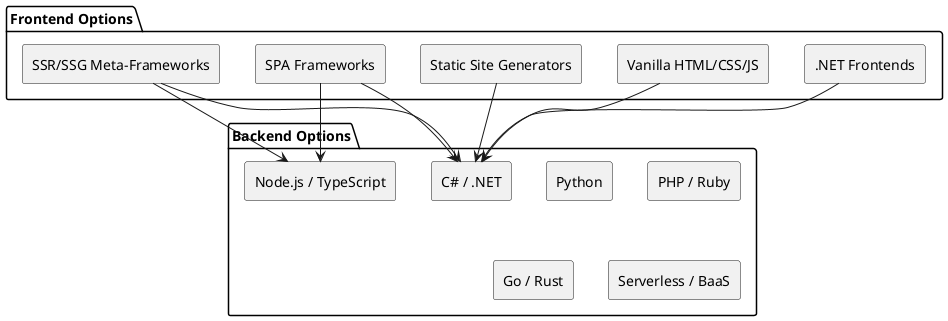

# Luxury Car Rental – Frontend & Backend Technology Options

This document compiles possible **frontend** and **backend** stacks for a luxury car rental platform, from minimal static setups to industry-standard full-stack architectures.

---

## 1. High-Level Architecture View

---

## 2. Frontend Technology Options

### 2.1 Level 1 – Vanilla Static Stack (No Build System)

**Use when:**

* Earliest MVP marketing site.
* Manual or semi-manual booking (form → email/WhatsApp).

**Stack:**

* **HTML**: Hand-written templates, semantic structure.
* **CSS:**

    * Plain CSS, or
    * Utility framework via CDN (Tailwind CDN, Bootstrap, PicoCSS, etc.).
* **JavaScript:**

    * Vanilla JS modules for interactions (booking forms, car galleries).
    * Optional small libraries (date picker, lightbox, carousel).

**Characteristics:**

* No node tooling required.
* Deployed as static files (NGINX, S3+CloudFront, Netlify, Vercel static export).

---

### 2.2 Level 2 – Enhanced Static / SSG

#### 2.2.1 Bundled Vanilla (with Vite or similar)

* Vite + plain JS/TS:

    * Modern ESM modules.
    * TypeScript support, bundling, code-splitting.
* CSS:

    * Tailwind CSS, SCSS, or PostCSS.

You still output static assets but with modern tooling.

#### 2.2.2 Static Site Generators (SSG)

* **Astro**

    * Content-first; ships the minimum JS.
    * Supports "islands" of interactivity (React, Vue, Svelte components).
* Others: Eleventy, Hugo, Jekyll.

**Use for:**

* High-performance marketing site + fleet gallery.
* Optional API calls for dynamic widgets (availability teaser, pricing highlights).

---

### 2.3 Level 3 – Single Page Applications (SPA, Client-Rendered)

**Main options:**

* **React SPA**

    * Built via Vite + React + TypeScript.
    * React Router for client-side routing.
* **Vue SPA** (Vite + Vue + TypeScript).
* **Svelte SPA** (Vite + Svelte).
* **Angular** (full framework, CLI-based).

**Characteristics:**

* App bootstraps once; navigation handled in browser.
* Data via HTTP calls to the backend API.

**Pros:**

* Component model scales well (fleet cards, booking steps, dashboards).
* Highly interactive, app-like experience.

**Cons:**

* SEO is harder without SSR/prerender.
* Needs careful bundle optimization.

---

### 2.4 Level 4 – SSR/SSG Meta-Frameworks (Industry Standard)

#### 2.4.1 React ecosystem

* **Next.js + React + TypeScript**

    * SSR (server-side rendering), SSG (static generation), CSR (client-side).
    * App Router for nested layouts, streaming, and data fetching.
    * Ideal for mixing marketing pages and authenticated app flows.

**Example use:**

* Landing, About, Fleet: SSG/SSR.
* Booking flow: a mix of server and client components.
* Account & admin: authenticated routes.

#### 2.4.2 Vue ecosystem

* **Nuxt** (Vue-based Next.js equivalent).

    * SSR + SSG + SPA modes.

#### 2.4.3 Others

* **SvelteKit** – modern, fast, flexible routing and data loading.
* **Remix** – React-based, server-first routing and mutations.

**Pros:**

* Great SEO and initial performance.
* One codebase for static + dynamic parts.

**Cons:**

* Requires Node runtime (for SSR) unless using static export mode.

---

### 2.5 Level 5 – .NET-Native Frontends

#### 2.5.1 ASP.NET Core MVC / Razor Views

* Controllers return Razor views.
* Strong server-rendering story.
* JS enhancements (HTMX, Alpine, custom JS) for interactivity.

Good for:

* Admin dashboards.
* Internal tools.
* Or even the full public site if you stay fully in .NET.

#### 2.5.2 Razor Pages

* Page-based model instead of controllers.
* Simpler mental model for page-centric apps.

#### 2.5.3 Blazor (Server/WASM)

* C# components rendered as HTML.
* **Blazor Server**: state kept on server via SignalR.
* **Blazor WebAssembly**: runs in the browser (C# compiled to WASM).

Pros:

* End-to-end C#.

Cons:

* Less common than React/Next in public-facing products.
* Larger initial download for WASM.

---

## 3. Backend Technology Options

### 3.1 Level 1 – Backend-lite / BaaS

#### 3.1.1 Backend-as-a-Service

* **Firebase** (Auth, Firestore, Functions, Storage).
* **Supabase** (Postgres, Auth, Storage).
* Other BaaS platforms (Appwrite, PocketBase).

Used for:

* Rapid prototypes.
* CRUD apps with simple business logic.

Pros:

* Minimal infra work.

Cons:

* Opinionated; complex rental logic (pricing, KYC, reporting) can feel constrained.

---

### 3.2 Level 2 – Single-Service API (Monolith API)

This is a strong fit for a car rental platform MVP.

#### 3.2.1 C# / .NET (primary recommendation)

* **ASP.NET Core Web API**

    * Controllers or minimal APIs.
    * Services and repositories for domain logic and persistence.
    * EF Core with PostgreSQL / SQL Server.
    * JWT-based authentication; role-based authorization.

* **ASP.NET Core Minimal APIs**

    * Function-style route handlers.
    * Same ASP.NET Core stack with less ceremony.

Typical domain modules:

* Fleet: Cars, categories, maintenance.
* Booking: Availability, pricing, reservations.
* Customer: Accounts, documents, KYC.
* Billing: Payments, refunds, invoices.

#### 3.2.2 Node.js / TypeScript

* **Express / Fastify**

    * Lightweight HTTP frameworks.
    * You add validation, routing, error handling.

* **NestJS**

    * Opinionated, Angular-like structure.
    * Modules, controllers, services, guards.
    * Integrated tooling for Swagger, validation, etc.

#### 3.2.3 Python

* **FastAPI**

    * Async-first, type-hinted, automatic OpenAPI docs.

* **Django + Django REST Framework (DRF)**

    * Traditional Django plus REST-focused tools.

#### 3.2.4 Other languages

* **PHP**: Laravel, Symfony.
* **Ruby**: Ruby on Rails.
* **Go**: Gin, Fiber, Echo.
* **Rust**: Actix, Axum.

All can expose REST/GraphQL endpoints for the frontend.

---

### 3.3 Level 3 – Full-Stack Frameworks (Views + API)

Backend frameworks that serve both HTML and JSON:

* **ASP.NET Core MVC**

    * Razor views for HTML.
    * Web API controllers for JSON.

* **Laravel**

    * Blade templates + API routes.

* **Django + DRF**

    * Django templates + REST endpoints.

* **Ruby on Rails**

    * ERB/HAML views + JSON responses.

Use pattern:

* Public frontend could be a JS app (Next.js, etc.).
* Admin/backend tools rendered by the same server-side framework.

---

### 3.4 Level 4 – Modular Monolith

Still a single deployable backend, but internally separated into domains:

* Modules:

    * Fleet
    * Booking
    * Customer
    * Billing
    * Notifications

* Each module has:

    * Entities
    * Services
    * Repositories
    * API endpoints

Can be implemented in ASP.NET Core, NestJS, Laravel, etc.

Pros:

* Organised codebase.
* Easier future extraction into microservices if necessary.

---

### 3.5 Level 5 – Microservices / Event-Driven

Overkill for MVP, but conceptually:

* Separate services:

    * Fleet Service
    * Booking Service
    * Payment Service
    * Notification Service
* API Gateway in front.
* Communication via events/queues (Kafka, RabbitMQ, SQS).

Use only when scale and team size justify the complexity.

---

## 4. Recommended Combinations for a Luxury Car Rental Platform

### 4.1 Simple Marketing-First MVP

* **Frontend:**

    * Astro or Next.js (SSG) + Tailwind.
* **Backend:**

    * No custom backend initially, or minimal ASP.NET Core API for contact/lead capture.

### 4.2 Full Booking System (Strong Default)

* **Frontend:**

    * Next.js + React + TypeScript + Tailwind.
* **Backend:**

    * ASP.NET Core Web API + EF Core + PostgreSQL.
* **Pattern:**

    * Modular monolith with clear domains.

### 4.3 .NET-Heavy Stack

* **Frontend:**

    * ASP.NET Core MVC/Razor for admin.
    * Optional public Razor site, or Next.js for public and Razor for internal.
* **Backend:**

    * Same ASP.NET solution, with separate Web API controllers.

These combinations give you a path from static MVP → fully featured rental engine without needing to change technology families mid-project.
